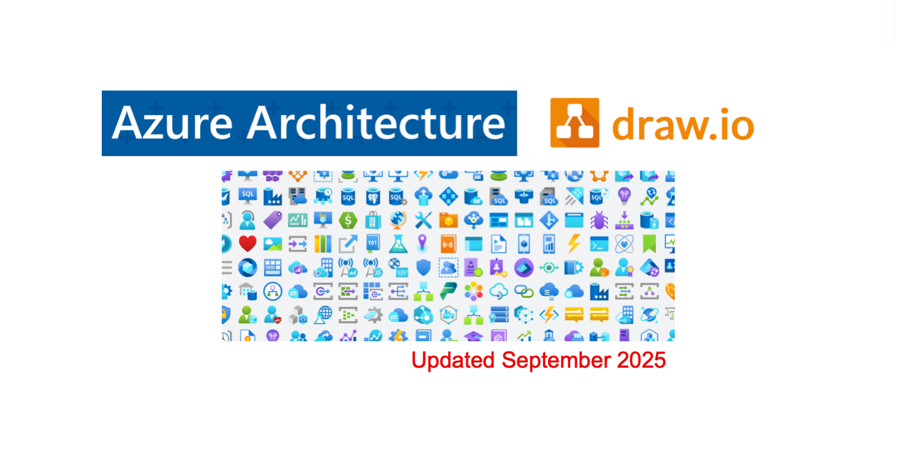

# Azure Architecture Icons for draw.io

A collection of Azure icons, featuring Azure product symbols, to assist in crafting architecture diagrams in draw.io.

## Microsoft Architecture Icons

### Open in draw.io online

- [000 - all azure public service icons](https://app.diagrams.net/?splash=0&clibs=Uhttps%3A%2F%2Fraw.githubusercontent.com%2Fdwarfered%2Fazure-architecture-icons-for-drawio%2Fmain%2Fazure-public-service-icons%2F000%20all%20azure%20public%20service%20icons.xml)

#### By group

- [001 - ai + machine learning](https://app.diagrams.net/?splash=0&clibs=Uhttps%3A%2F%2Fraw.githubusercontent.com%2Fdwarfered%2Fazure-architecture-icons-for-drawio%2Fmain%2Fazure-public-service-icons%2F001%20ai%20%2B%20machine%20learning.xml)

    

- [002 - analytics](https://app.diagrams.net/?splash=0&clibs=Uhttps%3A%2F%2Fraw.githubusercontent.com%2Fdwarfered%2Fazure-architecture-icons-for-drawio%2Fmain%2Fazure-public-service-icons%2F002%20analytics.xml)

    

- [003 - app services](https://app.diagrams.net/?splash=0&clibs=Uhttps%3A%2F%2Fraw.githubusercontent.com%2Fdwarfered%2Fazure-architecture-icons-for-drawio%2Fmain%2Fazure-public-service-icons%2F003%20app%20services.xml)

    

- [004 - azure ecosystem](https://app.diagrams.net/?splash=0&clibs=Uhttps%3A%2F%2Fraw.githubusercontent.com%2Fdwarfered%2Fazure-architecture-icons-for-drawio%2Fmain%2Fazure-public-service-icons%2F004%20azure%20ecosystem.xml)

    

- [005 - azure stack](https://app.diagrams.net/?splash=0&clibs=Uhttps%3A%2F%2Fraw.githubusercontent.com%2Fdwarfered%2Fazure-architecture-icons-for-drawio%2Fmain%2Fazure-public-service-icons%2F005%20azure%20stack.xml)

    

- [006 - blockchain](https://app.diagrams.net/?splash=0&clibs=Uhttps%3A%2F%2Fraw.githubusercontent.com%2Fdwarfered%2Fazure-architecture-icons-for-drawio%2Fmain%2Fazure-public-service-icons%2F006%20blockchain.xml)

    

- [007 - compute](https://app.diagrams.net/?splash=0&clibs=Uhttps%3A%2F%2Fraw.githubusercontent.com%2Fdwarfered%2Fazure-architecture-icons-for-drawio%2Fmain%2Fazure-public-service-icons%2F007%20compute.xml)

    

- [008 - containers](https://app.diagrams.net/?splash=0&clibs=Uhttps%3A%2F%2Fraw.githubusercontent.com%2Fdwarfered%2Fazure-architecture-icons-for-drawio%2Fmain%2Fazure-public-service-icons%2F008%20containers.xml)

    

- [009 - databases](https://app.diagrams.net/?splash=0&clibs=Uhttps%3A%2F%2Fraw.githubusercontent.com%2Fdwarfered%2Fazure-architecture-icons-for-drawio%2Fmain%2Fazure-public-service-icons%2F009%20databases.xml)

    

- [010 - devops](https://app.diagrams.net/?splash=0&clibs=Uhttps%3A%2F%2Fraw.githubusercontent.com%2Fdwarfered%2Fazure-architecture-icons-for-drawio%2Fmain%2Fazure-public-service-icons%2F010%20devops.xml)

    

- [011 - general](https://app.diagrams.net/?splash=0&clibs=Uhttps%3A%2F%2Fraw.githubusercontent.com%2Fdwarfered%2Fazure-architecture-icons-for-drawio%2Fmain%2Fazure-public-service-icons%2F011%20general.xml)

    

- [012 - hybrid + multicloud](https://app.diagrams.net/?splash=0&clibs=Uhttps%3A%2F%2Fraw.githubusercontent.com%2Fdwarfered%2Fazure-architecture-icons-for-drawio%2Fmain%2Fazure-public-service-icons%2F012%20hybrid%20%2B%20multicloud.xml)

    

- [013 - identity](https://app.diagrams.net/?splash=0&clibs=Uhttps%3A%2F%2Fraw.githubusercontent.com%2Fdwarfered%2Fazure-architecture-icons-for-drawio%2Fmain%2Fazure-public-service-icons%2F013%20identity.xml)

    

- [014 - integration](https://app.diagrams.net/?splash=0&clibs=Uhttps%3A%2F%2Fraw.githubusercontent.com%2Fdwarfered%2Fazure-architecture-icons-for-drawio%2Fmain%2Fazure-public-service-icons%2F014%20integration.xml)

    

- [015 - intune](https://app.diagrams.net/?splash=0&clibs=Uhttps%3A%2F%2Fraw.githubusercontent.com%2Fdwarfered%2Fazure-architecture-icons-for-drawio%2Fmain%2Fazure-public-service-icons%2F015%20intune.xml)

    

- [016 - iot](https://app.diagrams.net/?splash=0&clibs=Uhttps%3A%2F%2Fraw.githubusercontent.com%2Fdwarfered%2Fazure-architecture-icons-for-drawio%2Fmain%2Fazure-public-service-icons%2F016%20iot.xml)

    

- [017 - management + governance](https://app.diagrams.net/?splash=0&clibs=Uhttps%3A%2F%2Fraw.githubusercontent.com%2Fdwarfered%2Fazure-architecture-icons-for-drawio%2Fmain%2Fazure-public-service-icons%2F017%20management%20%2B%20governance.xml)

    

- [018 - menu](https://app.diagrams.net/?splash=0&clibs=Uhttps%3A%2F%2Fraw.githubusercontent.com%2Fdwarfered%2Fazure-architecture-icons-for-drawio%2Fmain%2Fazure-public-service-icons%2F018%20menu.xml)

    

- [019 - migrate](https://app.diagrams.net/?splash=0&clibs=Uhttps%3A%2F%2Fraw.githubusercontent.com%2Fdwarfered%2Fazure-architecture-icons-for-drawio%2Fmain%2Fazure-public-service-icons%2F019%20migrate.xml)

    

- [020 - migration](https://app.diagrams.net/?splash=0&clibs=Uhttps%3A%2F%2Fraw.githubusercontent.com%2Fdwarfered%2Fazure-architecture-icons-for-drawio%2Fmain%2Fazure-public-service-icons%2F020%20migration.xml)

    

- [021 - mixed reality](https://app.diagrams.net/?splash=0&clibs=Uhttps%3A%2F%2Fraw.githubusercontent.com%2Fdwarfered%2Fazure-architecture-icons-for-drawio%2Fmain%2Fazure-public-service-icons%2F021%20mixed%20reality.xml)

    

- [022 - mobile](https://app.diagrams.net/?splash=0&clibs=Uhttps%3A%2F%2Fraw.githubusercontent.com%2Fdwarfered%2Fazure-architecture-icons-for-drawio%2Fmain%2Fazure-public-service-icons%2F022%20mobile.xml)

    

- [023 - monitor](https://app.diagrams.net/?splash=0&clibs=Uhttps%3A%2F%2Fraw.githubusercontent.com%2Fdwarfered%2Fazure-architecture-icons-for-drawio%2Fmain%2Fazure-public-service-icons%2F023%20monitor.xml)

    

- [024 - networking](https://app.diagrams.net/?splash=0&clibs=Uhttps%3A%2F%2Fraw.githubusercontent.com%2Fdwarfered%2Fazure-architecture-icons-for-drawio%2Fmain%2Fazure-public-service-icons%2F024%20networking.xml)

    

- [025 - new icons](https://app.diagrams.net/?splash=0&clibs=Uhttps%3A%2F%2Fraw.githubusercontent.com%2Fdwarfered%2Fazure-architecture-icons-for-drawio%2Fmain%2Fazure-public-service-icons%2F025%20new%20icons.xml)

    

- [026 - other](https://app.diagrams.net/?splash=0&clibs=Uhttps%3A%2F%2Fraw.githubusercontent.com%2Fdwarfered%2Fazure-architecture-icons-for-drawio%2Fmain%2Fazure-public-service-icons%2F026%20other.xml)

    

- [027 - security](https://app.diagrams.net/?splash=0&clibs=Uhttps%3A%2F%2Fraw.githubusercontent.com%2Fdwarfered%2Fazure-architecture-icons-for-drawio%2Fmain%2Fazure-public-service-icons%2F027%20security.xml)

    

- [028 - storage](https://app.diagrams.net/?splash=0&clibs=Uhttps%3A%2F%2Fraw.githubusercontent.com%2Fdwarfered%2Fazure-architecture-icons-for-drawio%2Fmain%2Fazure-public-service-icons%2F028%20storage.xml)

    

- [029 - web](https://app.diagrams.net/?splash=0&clibs=Uhttps%3A%2F%2Fraw.githubusercontent.com%2Fdwarfered%2Fazure-architecture-icons-for-drawio%2Fmain%2Fazure-public-service-icons%2F029%20web.xml)

    

### Terms

- Azure Architecture Icons
- Microsoft 365 Architecture Icons

Microsoft permits the use of these icons in architectural diagrams, training materials, or documentation.
You may copy, distribute, and display the icons only for the permitted use unless granted explicit
permission by Microsoft. Microsoft reserves all other rights.

####  Do's
- Use the icons to illustrate how products can work together
- In diagrams, we recommend to include the product name somewhere close to the icon
- Use the icons as they would appear within Azure

#### Don'ts
- Don’t crop, flip or rotate icons
- Don’t distort or change icon shape in any way
- Don’t use Microsoft product icons to represent your product or service

## Project Developed Components

<!-- ### Azure Architecture Styling

### MFA Methods

 -->

### Terms

`.components\`

No license restrictions.

## Alternatively, download and save the files locally, then utilise the Open Library feature within draw.io

